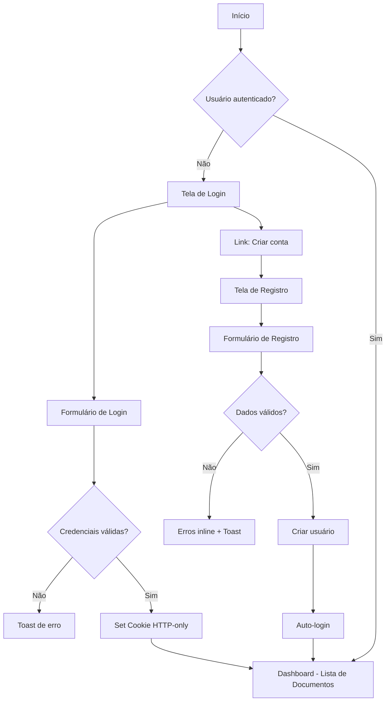
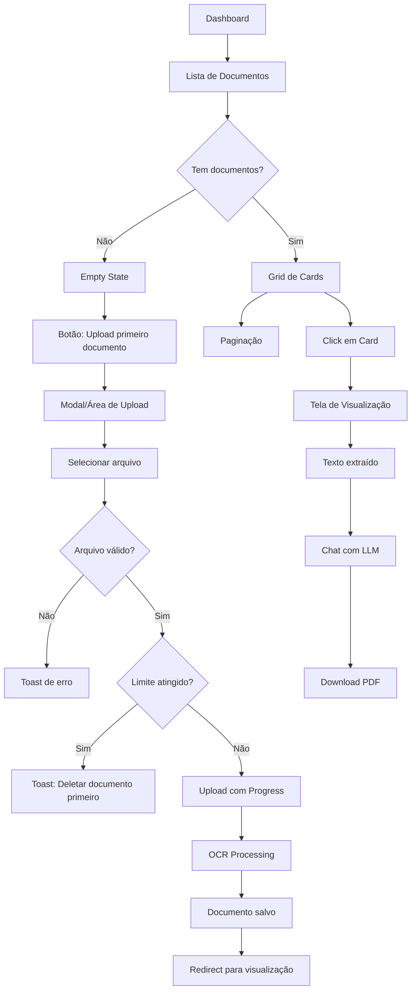
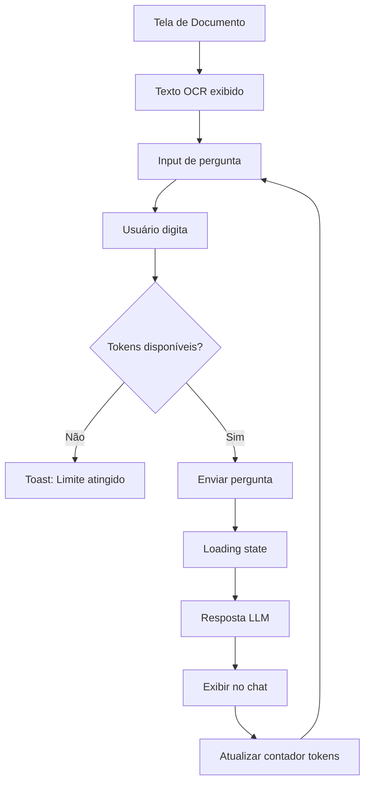

# Documentação Frontend - Sistema OCR com LLM

## 1. Visão Geral do Sistema

### 1.1 Arquitetura Técnica
- **Framework**: Next.js 14+ (App Router)
- **Linguagem**: TypeScript
- **Gerenciamento de Estado**: React Context API + Server Actions
- **Estilização**: Tailwind CSS
- **Validação**: Zod
- **HTTP Client**: Fetch API nativo (com Server Actions)
- **Autenticação**: Cookie HTTP-only, Secure, SameSite Strict

### 1.2 Observações de Build
```json
{
  "build": {
    "target": "server",
    "output": "standalone",
    "typescript": "strict mode habilitado",
    "envVars": "validadas em runtime com Zod"
  }
}
```

---

## 2. Estrutura de Diretórios

```
src/
├── app/
│   ├── (auth)/
│   │   ├── login/
│   │   │   └── page.tsx
│   │   └── registro/
│   │       └── page.tsx
│   ├── (dashboard)/
│   │   ├── documentos/
│   │   │   ├── page.tsx
│   │   │   └── [id]/
│   │   │       └── page.tsx
│   │   └── layout.tsx
│   ├── layout.tsx
│   └── api/
│       └── auth/
│           └── [...actions]/
│               └── route.ts
├── components/
│   ├── ui/
│   │   ├── button.tsx
│   │   ├── input.tsx
│   │   ├── card.tsx
│   │   ├── toast.tsx
│   │   ├── pagination.tsx
│   │   ├── loading.tsx
│   │   └── empty-state.tsx
│   ├── forms/
│   │   ├── login-form.tsx
│   │   ├── register-form.tsx
│   │   └── upload-form.tsx
│   └── document/
│       ├── document-card.tsx
│       ├── document-list.tsx
│       └── document-viewer.tsx
├── lib/
│   ├── actions/
│   │   ├── auth.ts
│   │   ├── documents.ts
│   │   └── llm.ts
│   ├── validations/
│   │   ├── auth.ts
│   │   └── document.ts
│   ├── utils.ts
│   └── constants.ts
├── types/
│   ├── auth.ts
│   ├── document.ts
│   └── api.ts
└── contexts/
    ├── auth-context.tsx
    └── toast-context.tsx
```

---

## 3. Fluxos de Navegação

### 3.1 Fluxo de Autenticação



### 3.2 Fluxo de Gestão de Documentos



### 3.3 Fluxo de Interação com LLM



---

## 4. Telas Detalhadas

### 4.1 Tela de Login (`/login`)

#### Layout
```
┌─────────────────────────────────────┐
│                                     │
│          [LOGO/BRAND]               │
│                                     │
│   ┌─────────────────────────────┐  │
│   │  Entrar na sua conta        │  │
│   │                             │  │
│   │  Email                      │  │
│   │  [input_______________]     │  │
│   │                             │  │
│   │  Senha                      │  │
│   │  [input_______________] 👁   │  │
│   │                             │  │
│   │  [Entrar - botão full]     │  │
│   │                             │  │
│   │  Não tem conta? Registre-se│  │
│   └─────────────────────────────┘  │
│                                     │
└─────────────────────────────────────┘
```

#### Funcionalidades
- **Validação em tempo real**: Email formato válido, senha mínimo 8 caracteres
- **Estados**:
  - Normal
  - Loading (botão desabilitado com spinner)
  - Erro (campos com borda vermelha + mensagem)
- **Toggle visualização de senha**
- **Toast de erro**: "Credenciais inválidas" ou erro de servidor
- **Toast de sucesso**: "Login realizado com sucesso"

#### Validações (Zod Schema)
```typescript
const loginSchema = z.object({
  email: z.string()
    .email('Email inválido')
    .min(1, 'Email obrigatório'),
  password: z.string()
    .min(8, 'Senha deve ter no mínimo 8 caracteres')
    .max(100, 'Senha muito longa')
});
```

---

### 4.2 Tela de Registro (`/registro`)

#### Layout
```
┌─────────────────────────────────────┐
│                                     │
│          [LOGO/BRAND]               │
│                                     │
│   ┌─────────────────────────────┐  │
│   │  Criar sua conta            │  │
│   │                             │  │
│   │  Nome completo              │  │
│   │  [input_______________]     │  │
│   │                             │  │
│   │  Email                      │  │
│   │  [input_______________]     │  │
│   │                             │  │
│   │  Senha                      │  │
│   │  [input_______________] 👁   │  │
│   │  • Mín 8 caracteres         │  │
│   │  • 1 maiúscula, 1 número    │  │
│   │                             │  │
│   │  Confirmar senha            │  │
│   │  [input_______________] 👁   │  │
│   │                             │  │
│   │  [Criar conta - botão full] │  │
│   │                             │  │
│   │  Já tem conta? Faça login   │  │
│   └─────────────────────────────┘  │
│                                     │
└─────────────────────────────────────┘
```

#### Funcionalidades
- **Validação progressiva**: Mostra requisitos da senha conforme digita
- **Força da senha**: Indicador visual (fraco/médio/forte)
- **Confirmação de senha**: Validação em tempo real
- **Estados de erro inline**: Abaixo de cada campo
- **Proteção contra rate limit**: Backend limitará tentativas

#### Validações (Zod Schema)
```typescript
const registerSchema = z.object({
  name: z.string()
    .min(3, 'Nome deve ter no mínimo 3 caracteres')
    .max(100, 'Nome muito longo'),
  email: z.string()
    .email('Email inválido')
    .min(1, 'Email obrigatório'),
  password: z.string()
    .min(8, 'Senha deve ter no mínimo 8 caracteres')
    .regex(/[A-Z]/, 'Deve conter pelo menos 1 letra maiúscula')
    .regex(/[0-9]/, 'Deve conter pelo menos 1 número')
    .max(100, 'Senha muito longa'),
  confirmPassword: z.string()
}).refine((data) => data.password === data.confirmPassword, {
  message: "As senhas não coincidem",
  path: ["confirmPassword"],
});
```

---

### 4.3 Tela de Gestão de Documentos (`/documentos`)

#### Layout - Com Documentos
```
┌─────────────────────────────────────────────────┐
│  [LOGO]    Documentos    [User Menu ▼] [Sair]  │
├─────────────────────────────────────────────────┤
│                                                 │
│  Meus Documentos (3/5)        [+ Upload]       │
│  ─────────────────────────────────────────      │
│                                                 │
│  ┌──────────┐  ┌──────────┐  ┌──────────┐     │
│  │ 📄       │  │ 📄       │  │ 📄       │     │
│  │ Nota     │  │ Fatura   │  │ Recibo   │     │
│  │ Fiscal   │  │ Energia  │  │ Aluguel  │     │
│  │          │  │          │  │          │     │
│  │ 15/11/24 │  │ 10/11/24 │  │ 05/11/24 │     │
│  │ Extraído │  │ Extraído │  │ Extraído │     │
│  │ [Ver] 🗑 │  │ [Ver] 🗑 │  │ [Ver] 🗑 │     │
│  └──────────┘  └──────────┘  └──────────┘     │
│                                                 │
│         [← Anterior]  1 2 3  [Próxima →]       │
│                                                 │
└─────────────────────────────────────────────────┘
```

#### Layout - Empty State
```
┌─────────────────────────────────────────────────┐
│  [LOGO]    Documentos    [User Menu ▼] [Sair]  │
├─────────────────────────────────────────────────┤
│                                                 │
│                                                 │
│                    📄                           │
│                                                 │
│          Nenhum documento ainda                 │
│                                                 │
│     Faça upload do seu primeiro documento       │
│     para extrair texto e usar o assistente      │
│                                                 │
│              [Upload Documento]                 │
│                                                 │
│                                                 │
└─────────────────────────────────────────────────┘
```

#### Funcionalidades
- **Header fixo** com navegação
- **Contador de documentos**: "3/5 documentos" com indicador visual
- **Grid responsivo**: 3 colunas desktop, 2 tablet, 1 mobile
- **Card hover state**: Elevação suave, borda highlight
- **Modal de upload**:
  - Drag & drop
  - Click para selecionar
  - Preview da imagem
  - Progress bar durante upload
  - Validação: PNG, JPG, PDF (max 10MB)
- **Confirmação de exclusão**: Modal "Tem certeza?"
- **Paginação**: 9 documentos por página
- **Loading skeleton**: Durante fetch inicial
- **Toast notifications**: Upload sucesso/erro, exclusão confirmada

#### Estados
1. **Loading inicial**: Skeleton cards
2. **Empty state**: Ícone + mensagem motivacional
3. **Com dados**: Grid de cards
4. **Limite atingido**: Botão upload desabilitado + tooltip

---

### 4.4 Tela de Visualização de Documento (`/documentos/[id]`)

#### Layout
```
┌───────────────────────────────────────────────────────┐
│  [← Voltar]  documento_123.jpg     [Download PDF] 🗑  │
├───────────────────────────────────────────────────────┤
│                                                       │
│  ┌─────────────────────┐  ┌─────────────────────┐   │
│  │                     │  │                     │   │
│  │  TEXTO EXTRAÍDO     │  │  ASSISTENTE LLM     │   │
│  │  ─────────────      │  │  ─────────────      │   │
│  │                     │  │                     │   │
│  │  Nota Fiscal        │  │  💬 Você:           │   │
│  │  Empresa XYZ        │  │  Qual o valor       │   │
│  │  CNPJ: 12.345...    │  │  total?             │   │
│  │                     │  │                     │   │
│  │  Produtos:          │  │  🤖 Assistente:     │   │
│  │  - Item A R$10      │  │  O valor total é    │   │
│  │  - Item B R$20      │  │  R$ 30,00           │   │
│  │                     │  │                     │   │
│  │  Total: R$ 30,00    │  │  ─────────────      │   │
│  │                     │  │                     │   │
│  │  [Copiar texto]     │  │  Tokens: 150/10000  │   │
│  │                     │  │                     │   │
│  └─────────────────────┘  │  [input pergunta__] │   │
│                           │  [Enviar]           │   │
│                           └─────────────────────┘   │
│                                                       │
└───────────────────────────────────────────────────────┘
```

#### Funcionalidades

**Painel Esquerdo - Texto OCR**
- Texto extraído com formatação preservada
- Scroll independente
- Botão "Copiar texto" com feedback visual
- Loading state durante extração inicial

**Painel Direito - Chat LLM**
- Histórico de conversas do documento
- Input de pergunta com auto-resize
- Contador de tokens: "150/10000" com cores:
  - Verde: < 70%
  - Amarelo: 70-90%
  - Vermelho: > 90%
- Botão desabilitado quando limite atingido
- Loading state: "Pensando..." com animação
- Auto-scroll para última mensagem
- Mensagens alternadas (usuário/assistente)

**Header**
- Breadcrumb: Voltar para lista
- Nome do documento editável (click para editar)
- Botão download PDF: Gera PDF com texto + chat
- Botão deletar com confirmação

#### Estados
1. **Loading OCR**: Skeleton no painel esquerdo
2. **Erro OCR**: Mensagem de erro + botão reprocessar
3. **Chat vazio**: Sugestões de perguntas
4. **Chat loading**: Indicador de digitação
5. **Limite tokens**: Banner de aviso

---

## 5. Contratos de API (Server Actions)

### 5.1 Autenticação

#### Login
```typescript
// lib/actions/auth.ts
export async function login(formData: LoginFormData): Promise<ActionResult> {
  // POST /api/auth/login
  // Response: Set-Cookie com JWT
  
  return {
    success: boolean;
    error?: string;
    redirect?: string;
  }
}
```

#### Registro
```typescript
export async function register(formData: RegisterFormData): Promise<ActionResult> {
  // POST /api/auth/register
  
  return {
    success: boolean;
    error?: string;
    userId?: string;
  }
}
```

#### Logout
```typescript
export async function logout(): Promise<void> {
  // POST /api/auth/logout
  // Clear cookie
}
```

#### Verificar Sessão
```typescript
export async function getSession(): Promise<Session | null> {
  // GET /api/auth/session
  // Valida cookie HTTP-only
  
  return {
    userId: string;
    email: string;
    name: string;
    documentsCount: number;
    documentsLimit: number;
    tokensUsed: number;
    tokensLimit: number;
  } | null;
}
```

---

### 5.2 Documentos

#### Listar Documentos
```typescript
export async function getDocuments(params: {
  page: number;
  limit: number;
}): Promise<PaginatedDocuments> {
  // GET /api/documents?page=1&limit=9
  
  return {
    documents: Array<{
      id: string;
      filename: string;
      uploadedAt: Date;
      status: 'processing' | 'completed' | 'error';
      extractedText?: string;
      thumbnailUrl?: string;
    }>;
    total: number;
    page: number;
    totalPages: number;
    hasMore: boolean;
  }
}
```

#### Upload Documento
```typescript
export async function uploadDocument(formData: FormData): Promise<UploadResult> {
  // POST /api/documents/upload
  // multipart/form-data
  
  return {
    success: boolean;
    documentId?: string;
    error?: string;
    message?: string;
  }
}
```

#### Obter Documento
```typescript
export async function getDocument(id: string): Promise<DocumentDetail> {
  // GET /api/documents/:id
  
  return {
    id: string;
    filename: string;
    uploadedAt: Date;
    fileUrl: string;
    extractedText: string;
    status: string;
    llmInteractions: Array<{
      id: string;
      question: string;
      answer: string;
      tokensUsed: number;
      createdAt: Date;
    }>;
  }
}
```

#### Deletar Documento
```typescript
export async function deleteDocument(id: string): Promise<ActionResult> {
  // DELETE /api/documents/:id
  
  return {
    success: boolean;
    error?: string;
  }
}
```

#### Download PDF
```typescript
export async function downloadDocumentPDF(id: string): Promise<Blob> {
  // GET /api/documents/:id/download
  // Returns PDF blob
}
```

---

### 5.3 LLM

#### Fazer Pergunta
```typescript
export async function askQuestion(params: {
  documentId: string;
  question: string;
}): Promise<LLMResponse> {
  // POST /api/llm/ask
  
  return {
    success: boolean;
    answer?: string;
    tokensUsed?: number;
    totalTokensUsed?: number;
    tokensRemaining?: number;
    error?: string;
  }
}
```

#### Obter Histórico
```typescript
export async function getLLMHistory(documentId: string): Promise<LLMInteraction[]> {
  // GET /api/documents/:id/llm-history
  
  return Array<{
    id: string;
    question: string;
    answer: string;
    tokensUsed: number;
    createdAt: Date;
  }>;
}
```

---

## 6. Tipos TypeScript

### 6.1 Auth Types
```typescript
// types/auth.ts
export interface User {
  id: string;
  email: string;
  name: string;
  createdAt: Date;
}

export interface Session {
  userId: string;
  email: string;
  name: string;
  documentsCount: number;
  documentsLimit: number;
  tokensUsed: number;
  tokensLimit: number;
}

export interface LoginFormData {
  email: string;
  password: string;
}

export interface RegisterFormData {
  name: string;
  email: string;
  password: string;
  confirmPassword: string;
}
```

### 6.2 Document Types
```typescript
// types/document.ts
export type DocumentStatus = 'processing' | 'completed' | 'error';

export interface Document {
  id: string;
  filename: string;
  uploadedAt: Date;
  status: DocumentStatus;
  extractedText?: string;
  thumbnailUrl?: string;
}

export interface DocumentDetail extends Document {
  fileUrl: string;
  extractedText: string;
  llmInteractions: LLMInteraction[];
}

export interface LLMInteraction {
  id: string;
  question: string;
  answer: string;
  tokensUsed: number;
  createdAt: Date;
}

export interface PaginatedDocuments {
  documents: Document[];
  total: number;
  page: number;
  totalPages: number;
  hasMore: boolean;
}
```

---

## 7. Componentes Reutilizáveis

### 7.1 Button Component
```typescript
// components/ui/button.tsx
interface ButtonProps {
  variant?: 'primary' | 'secondary' | 'danger' | 'ghost';
  size?: 'sm' | 'md' | 'lg';
  isLoading?: boolean;
  disabled?: boolean;
  children: React.ReactNode;
  onClick?: () => void;
}
```

**Estados**:
- Normal
- Hover (cor mais escura, cursor pointer)
- Active (pressed effect)
- Disabled (opacidade 50%, cursor not-allowed)
- Loading (spinner + texto "Carregando...")

---

### 7.2 Input Component
```typescript
// components/ui/input.tsx
interface InputProps {
  label: string;
  type?: 'text' | 'email' | 'password';
  error?: string;
  disabled?: boolean;
  value: string;
  onChange: (value: string) => void;
}
```

**Estados**:
- Normal (borda cinza)
- Focus (borda azul, outline shadow)
- Error (borda vermelha + mensagem abaixo)
- Disabled (background cinza claro)

---

### 7.3 Toast Component
```typescript
// components/ui/toast.tsx
interface ToastProps {
  type: 'success' | 'error' | 'info' | 'warning';
  message: string;
  duration?: number; // default 5000ms
}
```

**Comportamento**:
- Aparece no top-right
- Auto-dismiss após duration
- Animação slide-in/fade-out
- Empilhável (múltiplos toasts)
- Click para fechar manualmente

---

### 7.4 Pagination Component
```typescript
// components/ui/pagination.tsx
interface PaginationProps {
  currentPage: number;
  totalPages: number;
  onPageChange: (page: number) => void;
}
```

**Comportamento**:
- Mostra no máximo 5 números
- Botões Anterior/Próxima
- Página atual destacada
- Desabilita botões nos extremos

---

### 7.5 Loading Component
```typescript
// components/ui/loading.tsx
interface LoadingProps {
  variant?: 'spinner' | 'skeleton' | 'dots';
  size?: 'sm' | 'md' | 'lg';
}
```

**Tipos**:
- **Spinner**: Loader circular animado
- **Skeleton**: Cards/linhas pulsantes
- **Dots**: Três pontos animados

---

### 7.6 Empty State Component
```typescript
// components/ui/empty-state.tsx
interface EmptyStateProps {
  icon: React.ReactNode;
  title: string;
  description: string;
  action?: {
    label: string;
    onClick: () => void;
  };
}
```

---

## 8. Considerações de Segurança Frontend

### 8.1 Autenticação
- **Cookie HTTP-only**: JavaScript não acessa o token
- **Secure flag**: Apenas HTTPS (produção)
- **SameSite Strict**: Proteção CSRF
- **Renovação automática**: Refresh token via Server Action
- **Logout**: Clear cookie server-side

### 8.2 Validação
- **Client-side**: Zod para UX rápida
- **Server-side**: SEMPRE revalidar (não confiar no client)
- **Sanitização**: DOMPurify para texto extraído (se renderizar HTML)

### 8.3 Rate Limiting
- Backend aplica rate limit
- Frontend mostra mensagens claras quando atingido
- Desabilita botões preventivamente

### 8.4 Upload
- Validação de tipo MIME
- Limite de tamanho (10MB)
- Preview seguro (sem executar scripts)
- Progress tracking

---

## 9. Performance e Otimizações

### 9.1 Next.js Específico
- **Server Components**: Usar por padrão
- **Client Components**: Apenas quando necessário (interatividade)
- **Server Actions**: Para mutações
- **Dynamic imports**: Componentes pesados (ex: PDF viewer)
- **Image optimization**: next/image para thumbnails

### 9.2 Caching
- **Lista de documentos**: Cache com revalidation
- **Documento individual**: Cache agressivo
- **Session**: Cache server-side

### 9.3 Loading States
- **Suspense boundaries**: Para Server Components
- **Skeleton UI**: Melhor UX que spinners genéricos
- **Optimistic updates**: Para deleção de documentos

---

## 10. Acessibilidade (A11y)

### 10.1 Requisitos Mínimos
- **Semantic HTML**: headings, nav, main, article
- **ARIA labels**: Botões de ícones, estados loading
- **Keyboard navigation**: Tab order lógico, Enter/Space em botões
- **Focus visible**: Outline em todos os elementos focáveis
- **Alt text**: Imagens e ícones
- **Color contrast**: WCAG AA (4.5:1 para texto normal)

### 10.2 Screen Readers
- Live regions para toasts
- Anúncios de loading states
- Labels descritivos para formulários

---

## 11. Responsividade

### 11.1 Breakpoints (Tailwind)
```typescript
const breakpoints = {
  sm: '640px',  // Mobile landscape
  md: '768px',  // Tablet
  lg: '1024px', // Desktop
  xl: '1280px', // Large desktop
};
```

### 11.2 Adaptações por Tela

**Mobile (< 640px)**:
- Menu hamburger
- Cards em coluna única
- Upload fullscreen modal
- Chat LLM em tab separada

**Tablet (640-1024px)**:
- Grid 2 colunas
- Sidebar colapsável
- Chat inline

**Desktop (> 1024px)**:
- Grid 3 colunas
- Sidebar fixa
- Split view documento + chat

---

## 12. Tratamento de Erros

### 12.1 Tipos de Erros

**Erros de Rede**:
```typescript
{
  type: 'network',
  message: 'Não foi possível conectar ao servidor',
  retry: true
}
```

**Erros de Validação**:
```typescript
{
  type: 'validation',
  field: 'email',
  message: 'Email inválido'
}
```

**Erros de Negócio**:
```typescript
{
  type: 'business',
  code: 'DOCUMENT_LIMIT_REACHED',
  message: 'Você atingiu o limite de 5 documentos'
}
```

**Erros de Servidor**:
```typescript
{
  type: 'server',
  message: 'Erro interno do servidor',
  retry: true
}
```

### 12.2 Estratégias

1. **Toast para feedback rápido**
2. **Inline errors para formulários**
3. **Error boundaries para erros críticos**
4. **Retry automático para erros de rede (3x)**
5. **Fallback UI para componentes que falharem**

---

## 14. Variáveis de Ambiente

```bash
# .env.local
NEXT_PUBLIC_APP_URL=http://localhost:3000
NEXT_PUBLIC_API_URL=http://localhost:3000/api

# Limites (públicos para UI)
NEXT_PUBLIC_MAX_DOCUMENTS=5
NEXT_PUBLIC_MAX_TOKENS=10000
NEXT_PUBLIC_MAX_FILE_SIZE=10485760 # 10MB
```

---

## 17. Design System 

### 17.1 Cores
```css
:root {
  /* Primary */
  --primary-50: #eff6ff;
  --primary-500: #3b82f6;
  --primary-600: #2563eb;
  --primary-700: #1d4ed8;
  
  /* Neutral */
  --gray-50: #f9fafb;
  --gray-100: #f3f4f6;
  --gray-500: #6b7280;
  --gray-900: #111827;
  
  /* Semantic */
  --success: #10b981;
  --error: #ef4444;
  --warning: #f59e0b;
  --info: #3b82f6;
}
```

